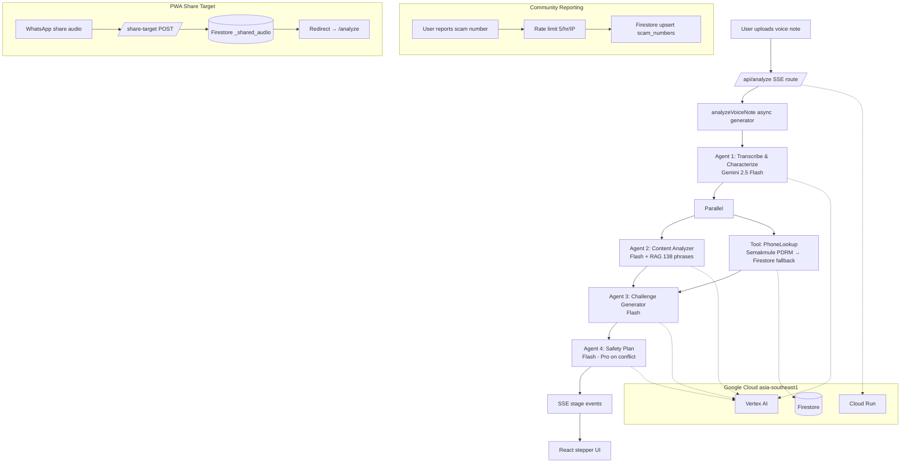

# DengarDulu — Listen First. Answer Wisely.

> **AI safety copilot for Malaysian voice-note scams.**
> Forward a suspicious WhatsApp voice note. Get a verdict, red-flag list, and a personalized verification question in 15 seconds. Powered by Gemini 2.5 Flash on Vertex AI.

**🌐 Live:** https://dengardulu-169906713421.asia-southeast1.run.app
**🎓 Hackathon:** [Project 2030 · MyAI Future](https://projek2030.gdguctm.my) — GDG On Campus UTM, Malaysia
**🏁 Track:** 5 · Secure Digital (FinTech & Security)

---

## The Problem

AI voice-cloning scams are the fastest-growing fraud vector in Malaysia, and citizens have **no real-time way to verify a suspicious voice note** before acting on it.

- **454+** deepfake voice impersonation cases investigated by CCID since early 2024 — losses reaching **RM 2.72 million** ([Malay Mail, 28 Aug 2024](https://www.malaymail.com/news/malaysia/2024/08/28/ccid-director-over-450-deepfake-scams-under-police-investigation-losses-reach-rm272m/148500) · [Bernama](https://bernama.com/en/crime_courts/news.php?id=2334316))
- **12,110** scams in Q1 2025 alone, totaling **RM 573.7M** in losses ([RinggitPlus, 18 Apr 2025](https://ringgitplus.com/en/blog/personal-finance-news/rm573-million-lost-to-online-fraud-in-q1-2025-police-warn-of-ai-driven-scams.html))
- Scam calls in Malaysia **surged 82.81%** across 2024 ([Malay Mail, 3 Mar 2025](https://www.malaymail.com/news/malaysia/2025/03/03/the-dark-side-of-ai-scam-calls-nearly-double-in-malaysia-across-2024/168530))
- A woman lost **RM 5,000** after her *boss's* AI-cloned voice asked her via phone to buy Touch 'n Go PINs ([The Rakyat Post, 14 May 2025](https://www.therakyatpost.com/news/malaysia/2025/05/14/woman-loses-rm5k-after-answering-a-call-from-boss/) · [Malay Mail, 4 Aug 2025](https://www.malaymail.com/news/malaysia/2025/08/04/ai-scams-are-getting-real-here-are-the-cases-happening-in-malaysia-that-you-should-know-about/183459))

Banks freeze accounts only *after* the transfer. DengarDulu intervenes *before*.

---

## The Insight

Other solutions chase binary deepfake classification, which is hard, slow, and an arms race we lose. DengarDulu reframes the problem:

> **Hand the user a personalized counter-question.**
> Scammers cannot answer questions that rely on private shared memory. Real people can. This is the action layer that separates a *detector* from a *copilot*.

---

## What It Does

Upload a suspicious voice note; within ~15 seconds receive:

1. **Verdict** — `LOW` / `MEDIUM` / `HIGH` with a 0–100 suspicion score
2. **Transcript + voice-prosody observations** (intonation, pauses, breathing, pitch stability, synthetic cues, emotion authenticity)
3. **Bilingual red-flag list** grounded in a corpus of 138 Malaysian scam phrases (BM / EN / Manglish)
4. **Two personalized challenge questions** you can copy-paste or **send directly to WhatsApp**
5. **Phone reputation** checked live against **Semakmule PDRM** (227K+ police records) with Firestore fallback + deep links to official sources (Semakmule CCID, BNM FCAL, MCMC)
6. **Concrete action plan** with Malaysian hotlines (CCID, BNM, 999)
7. **Analysis history** — past results saved locally (localStorage, last 10), viewable at `/history`
8. **Community scam-number reporting** — report a phone number from the result page; reports upsert to Firestore `scam_numbers` (rate-limited 5/hr per IP)
9. **PWA — install & share from WhatsApp** — installable on Android/iOS; Web Share Target API lets users share audio straight from WhatsApp into DengarDulu
10. **Easy Mode (accessibility)** — first-visit age onboarding; users 50+ auto-enable larger fonts + simplified layout. Toggleable from NavBar
11. **Guided walkthrough** — spotlight-overlay interactive tour (homepage + analyze page), auto-starts on first visit
12. **Floating NavBar** — language switcher (EN/BM), Easy Mode toggle, PWA install button, walkthrough restart, history link

---

## Architecture



### Why agentic, not single-shot

Each Gemini call has a tightly scoped role and structured-output contract. The ChallengeGenerator never sees raw audio (only transcript + content analysis); the SafetyPlan never re-transcribes. This keeps costs down, context focused, and surfaces where each agent's reasoning lives for the transparency panel (the stepper's "Show agent output" toggle).

See **[GEMINI.md](./GEMINI.md)** for the full AI implementation declaration.

---

## Tech Stack

| Layer | Choice |
|---|---|
| **Frontend** | Next.js 16 App Router (Turbopack) · TypeScript · Tailwind v4 · custom Mastercard-inspired design system |
| **AI orchestration** | Firebase Genkit JS 1.32 (`@genkit-ai/google-genai`) |
| **Models** | Gemini 2.5 Flash (default) · Gemini 2.5 Pro (escalation) · served via **Vertex AI** `asia-southeast1` |
| **Data** | Firestore (native mode, `asia-southeast1`) — 138 scam phrases + 30 seed phone numbers |
| **Phone intel** | Semakmule PDRM live API (227K+ police records) → Firestore fallback |
| **Streaming** | Server-Sent Events for stage-by-stage UI updates |
| **Reliability** | Exponential-backoff retry (5 attempts, jitter) · SHA-256 audio cache (32 entries, 1h TTL) |
| **UI primitives** | shadcn/ui (Base UI) · Sonner (toasts) · tw-animate-css · Lucide icons |
| **PWA** | Web App Manifest · Service Worker · Web Share Target API (share audio from WhatsApp) |
| **Accessibility** | Age onboarding modal · Easy Mode (large fonts + simplified layout) · guided spotlight walkthrough |
| **Auth** | ADC — Cloud Run default SA; no API keys in production |
| **Deploy** | Docker multi-stage (node:20-alpine, standalone Next output) · Cloud Run `asia-southeast1` with `--min-instances 1` during demo |

---

## Semakmule PDRM Integration

DengarDulu connects to the **Semakmule PDRM live database** — the official Malaysian police (CCID) scam-number registry with **227,125+ phone records** and **288,239+ scam account records** (as of May 2026).

### How it works

```
User inputs phone number
        │
        ▼
┌─────────────────────────────────────────────────┐
│  1. Semakmule PDRM Live API (primary)           │
│                                                 │
│  POST /api/mule/get_search_data.php             │
│  Body: { data: { category: "telefon",           │
│                   telNo: "0104269914" } }        │
│                                                 │
│  Returns: table_data with per-number report     │
│  count from the PDRM CCID database.             │
│  Timeout: 5 seconds                             │
└──────────────┬──────────────────────────────────┘
               │ If Semakmule is unreachable
               ▼
┌─────────────────────────────────────────────────┐
│  2. Firestore fallback (seed + community data)  │
│                                                 │
│  Exact match on normalized phone, then          │
│  last-8-digit match for prefix variations.      │
└──────────────┬──────────────────────────────────┘
               │
               ▼
┌─────────────────────────────────────────────────┐
│  3. Result with source attribution              │
│                                                 │
│  { found: true, report_count: 68,               │
│    source: "semakmule",                         │
│    external_sources: [Semakmule, BNM, MCMC] }   │
└─────────────────────────────────────────────────┘
```

### Phone number normalization

The lookup automatically tries multiple Malaysian phone formats:

| User input | Formats tried |
|---|---|
| `0172345678` | `0172345678` |
| `60172345678` | `60172345678` → `0172345678` |
| `+60172345678` | `+60172345678` → `0172345678` |
| `017-234 5678` | strips to `0172345678` |

### Data source attribution

The UI shows a badge indicating the source:
- **"Sumber: Semakmule PDRM · Data Langsung"** — real-time data from the police database
- No badge — result from local Firestore seed data

### Suspicion score computation

The suspicion score (0–100) is computed **deterministically** from structured agent outputs, not by the LLM. This ensures scores are always consistent with the verdict:

| Signal | Points |
|---|---|
| High-risk sensitive request (money transfer, OTP, bank login, etc.) | +30 |
| Urgency score ≥ 8 | +15 |
| Authority impersonation with missing credibility cues | +20 |
| Secrecy markers (per marker, max 2) | +10 each |
| Phone found in scam DB (≥ 3 reports) | +25 |
| Phone found in scam DB (< 3 reports) | +15 |
| Incongruent voice emotion | +10 |
| ≥ 2 synthetic voice cues | +5 |
| ≥ 3 RAG scam-pattern hits | +5 |

Verdict thresholds: **LOW** < 25, **MEDIUM** 25–74, **HIGH** ≥ 75.

---

## Local Setup

### Prerequisites
- Node 20+
- `gcloud` CLI authenticated to a GCP project with Firestore native mode, Vertex AI, and (optionally) Secret Manager enabled
- A service-account JSON with `roles/aiplatform.user` + `roles/datastore.user`

### 1. Clone & install

```bash
git clone https://github.com/<your-org>/dengardulu.git
cd dengardulu
npm install
```

### 2. Configure environment

Create `.env.local`:

```bash
GOOGLE_APPLICATION_CREDENTIALS=./service-account.json
GCP_PROJECT_ID=your-gcp-project-id
GCP_LOCATION=asia-southeast1
FIREBASE_PROJECT_ID=your-gcp-project-id
```

Place your service-account JSON at `./service-account.json` (gitignored).

### 3. Seed Firestore

```bash
npm run seed               # first run
npm run seed -- --force    # re-seed / upsert after data changes
```

### 4. Run dev server

```bash
npm run dev
# open http://localhost:3000
```

For Genkit dev UI (inspect each agent's structured output live):

```bash
npm run genkit
# open http://localhost:4000
```

---

## Deploy to Cloud Run

```bash
gcloud run deploy dengardulu \
  --source . \
  --region asia-southeast1 \
  --allow-unauthenticated \
  --min-instances 1 --max-instances 10 \
  --memory 1Gi --cpu 1 --timeout 120 \
  --set-env-vars "GCP_PROJECT_ID=<proj>,GCP_LOCATION=asia-southeast1,FIREBASE_PROJECT_ID=<proj>" \
  --project <proj>
```

The default compute service account must have `roles/aiplatform.user` + `roles/datastore.user`:

```bash
PROJECT_NUMBER=$(gcloud projects describe <proj> --format='value(projectNumber)')
for role in aiplatform.user datastore.user; do
  gcloud projects add-iam-policy-binding <proj> \
    --member="serviceAccount:${PROJECT_NUMBER}-compute@developer.gserviceaccount.com" \
    --role="roles/${role}" --condition=None
done
```

No `GEMINI_API_KEY` secret is required — Vertex AI uses ADC.

---

## Environment Variables

| Var | Where | Purpose |
|---|---|---|
| `GCP_PROJECT_ID` | local + Cloud Run | Vertex AI project |
| `GCP_LOCATION` | local + Cloud Run | Vertex AI region (default `asia-southeast1`) |
| `FIREBASE_PROJECT_ID` | local + Cloud Run | Firestore project (usually same as GCP_PROJECT_ID) |
| `GOOGLE_APPLICATION_CREDENTIALS` | **local only** | Path to SA JSON. Cloud Run uses metadata-service credentials automatically |
| `ESCALATE_TO_PRO` | optional | Set `true` to allow SafetyPlan to promote to Gemini 2.5 Pro on conflicting signals |

---

## API Routes

| Endpoint | Method | Purpose |
|---|---|---|
| `/api/analyze` | `POST` | SSE stream — accepts audio + phone + role, returns stage-by-stage analysis events |
| `/api/report-number` | `POST` | Community scam-number report — accepts `{ phone }`, rate-limited 5/hr/IP, upserts to Firestore `scam_numbers` |
| `/share-target` | `POST` | PWA Web Share Target — receives audio from Android/iOS share sheet, stores temporarily in Firestore |
| `/share-target` | `GET` | Retrieves temporary shared audio by `?id=` and redirects to `/analyze` (one-time read) |

---

## AI Declaration

Gemini and Google AI tooling used per hackathon rules:

- **Models:** Gemini 2.5 Flash (all 4 agents, default) · Gemini 2.5 Pro (escalation)
- **Runtime:** Vertex AI (`asia-southeast1`)
- **Framework:** Firebase Genkit JS
- **Dev tooling:** Google AI Studio (prompt iteration), Antigravity (agentic IDE scaffolding), Genkit Developer UI (live flow debugging), Claude Code by Anthropic (frontend/infra pair-programming)
- **Training:** None. Zero-shot only.

Full implementation details and agent architecture: **[GEMINI.md](./GEMINI.md)**.

---

## Judging Rubric Alignment

| Criterion | Max | How we score |
|---|---|---|
| **AI Implementation & Technical Execution** | 25 | 4 Gemini agents + 1 tool + RAG grounding + Genkit orchestration + structured JSON + Vertex AI + retry/cache resilience |
| **Innovation & Creativity** | 20 | The *counter-question* framing — reframing detection into action. Voice prosody + content cues + personalized verification Q is a novel combination. PWA Share Target lets users forward audio directly from WhatsApp. Community reporting creates a crowd-sourced scam DB alongside PDRM data |
| **Impact & Problem Relevance** | 20 | Malaysia stats, BM/EN/Manglish support, 138 Malaysian scam-phrase RAG, local hotlines (CCID / BNM / 999), aligns with MyDIGITAL + FinTech track. Easy Mode + age onboarding prioritizes the 50+ demographic most targeted by scams. Guided walkthrough ensures first-time users can navigate the tool |
| **UI/UX & Presentation** | 10 | Bilingual toggle, responsive, aria-live agentic stepper, Mastercard-inspired design system, floating NavBar, Easy Mode (large fonts + simplified layout), guided spotlight walkthrough, PWA installable |
| **Code Quality** | 15 | Modular agents, Zod input validation, TypeScript strict, IAM-based auth (no API-key secrets), retry + cache, documented prompts, localStorage history (privacy-first), rate-limited community API, PWA manifest + share target |
| **Pitch / Video** | 10 | See submitted materials |

---

## Roadmap (Post-Hackathon)

- ~~**Community reporting**~~ **Done** — community reporting live with rate-limited API, Firestore upsert
- ~~**Analysis history**~~ **Done** — localStorage-backed history (last 10 entries); Firebase Auth upgrade deferred
- **Real deepfake classifier** — complement voice observations with AASIST / RawNet audio inference
- **WhatsApp Business webhook** — users forward voice notes directly into a WA chatbot
- **Vertex AI Vector Search** — graduate RAG from inline corpus at >1k items
- **Push notifications** — alert users when a number they reported gets confirmed by PDRM

---

## Limits — Honestly Stated

1. **Not a deepfake confirmation.** Voice cues alone cannot prove synthesis. We output *"suspicion score"*, never a binary *"this is fake"*.
2. **Phone lookup is live but not exhaustive.** Primary source is Semakmule PDRM (227K+ records, live). Firestore seed (30 numbers) serves as fallback. For manual verification, the UI deep-links to [Semakmule](https://semakmule.rmp.gov.my), BNM FCAL, MCMC.
3. **Audio size capped at 20 MB** (inline base64). Longer audio would need Files API — deferred.
4. **Cache is in-memory.** Cold starts lose the cache. `--min-instances 1` keeps the demo warm; a future Firestore-backed cache would survive restarts.
5. **Community reports are anonymous.** No authentication required; rate-limiting (5/hr/IP) mitigates spam but cannot fully prevent coordinated abuse. A verified-user gate is planned.

---

## Repo Layout

```
dengardulu/
├── src/
│   ├── app/
│   │   ├── page.tsx              # Landing (hero + stats + features + hotlines)
│   │   ├── layout.tsx            # Root layout: fonts, NavBar, AgeOnboarding, Toaster
│   │   ├── analyze/page.tsx      # Upload + SSE stepper + ResultReport
│   │   ├── history/page.tsx      # localStorage-backed analysis history viewer
│   │   ├── share-target/route.ts # PWA Web Share Target (POST audio → redirect)
│   │   ├── opengraph-image.tsx   # Dynamic OG image
│   │   ├── twitter-image.tsx     # Dynamic Twitter card image
│   │   └── api/
│   │       ├── analyze/route.ts      # POST — SSE analysis stream + audio cache
│   │       └── report-number/route.ts # POST — community scam-number report
│   ├── ai/
│   │   ├── genkit.ts             # Plugin init, retry wrapper, model tiers
│   │   ├── schemas.ts            # All Zod structured-output contracts
│   │   ├── flows/analyze.ts      # Master async-generator flow
│   │   ├── steps/                # 4 agents: transcribe, content-analyzer, challenge, safety-plan
│   │   └── tools/                # phone-lookup (Semakmule PDRM → Firestore fallback)
│   ├── components/
│   │   ├── NavBar.tsx            # Floating nav: lang switch, Easy Mode, PWA install, walkthrough
│   │   ├── AgeOnboarding.tsx     # First-visit "Are you 50+?" modal → Easy Mode
│   │   ├── Walkthrough.tsx       # Spotlight-overlay guided tour engine
│   │   ├── Dropzone.tsx          # Audio upload with drag-and-drop
│   │   ├── AgentStepper.tsx      # SSE-driven progress stepper with agent output toggle
│   │   ├── ResultReport.tsx      # Full analysis result: verdict, red-flags, actions, report CTA
│   │   ├── VerdictBadge.tsx      # LOW/MEDIUM/HIGH badge with suspicion bar
│   │   ├── Logo.tsx              # Logo + wordmark
│   │   └── ui/                   # shadcn/ui primitives (button, card, dialog, badge, etc.)
│   ├── hooks/
│   │   └── usePWAInstall.ts      # beforeinstallprompt hook for PWA install button
│   ├── lib/
│   │   ├── firebase-admin.ts     # Firestore client (ADC)
│   │   ├── sse.ts                # SSE encoder utility
│   │   ├── analysis-cache.ts     # SHA-256 in-memory audio cache (32 entries, 1h TTL)
│   │   ├── history.ts            # localStorage read/write for analysis history
│   │   ├── walkthrough-steps.ts  # Tour step definitions (homepage + analyze)
│   │   └── utils.ts              # Tailwind merge helper
│   ├── i18n/messages.ts          # BM + EN dictionary
│   └── data/                     # Firestore seed JSONs (138 phrases + 30 numbers)
├── public/
│   ├── manifest.json             # PWA manifest with share_target for audio
│   ├── sw.js                     # Service worker (install + activate)
│   ├── icon-192.png              # PWA icon
│   ├── icon-512.png              # PWA icon
│   └── icon-maskable-512.png     # PWA maskable icon
├── scripts/seed-firestore.ts     # Upsert seed data
├── docs/prompts/                 # Human-readable system prompts per agent
├── tests/fixtures/               # Test audio (gitignored)
├── GEMINI.md                     # AI implementation declaration
└── README.md                     # This file
```

---

## License

MIT © 2026 DengarDulu Team — built for Project 2030: MyAI Future Hackathon, GDG On Campus UTM.

---

## Credits

- **Gemini 2.5** by Google DeepMind — the audio + language model
- **Firebase Genkit** — the agentic orchestration layer
- **GDG On Campus UTM** — for hosting Project 2030
- **CCID Malaysia / BNM / MCMC** — for the scam-awareness data we ground against
